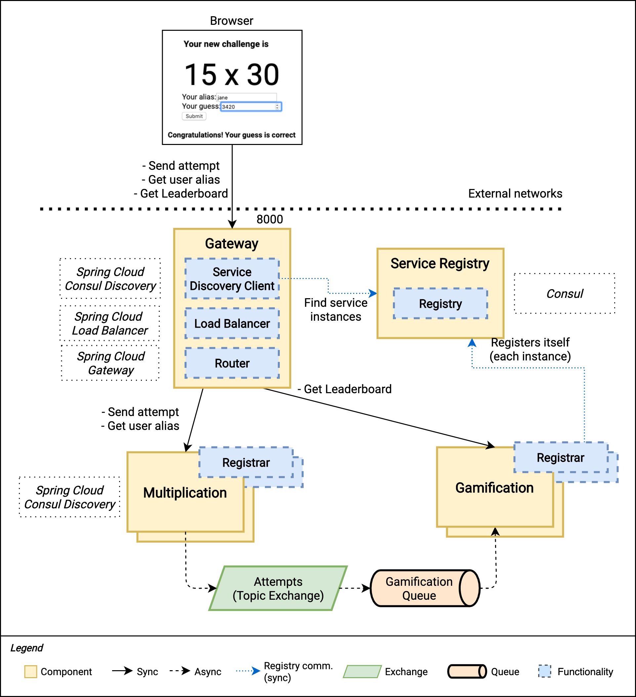

# Learn Microservices with Spring Boot - Chapter 8b (2/4)

This repository contains the source code of the practical use case described in the book [Learn Microservices with Spring Boot (2nd Edition)](https://tpd.io/book-extra).

The book follows a pragmatic approach to building a Microservice Architecture. You start with a small monolith and examine the _pros_ and _cons_ that come with a move to microservices. 

## Chapter 8 version 2/4

The Chapter 8's source code is divided into four parts for a better understanding of how the system evolves when we start introducing _Common Patterns in Microservice Architectures_.

In this second part, we introduce Service Discovery and Load Balancing, supported by the microservices' health checks. These patterns allow us to scale up our system, and to make it more resilient.



The main concepts included in this first part of the chapter are:

* Why do we need Service Discovery, a Load Balancer and a Health endpoint? The problems, explained.
* Basic concepts: Client-Side vs. Server-Side Discovery, Load Balancers, the Service Registry, detecting unhealthy instances, etc.
* Spring Cloud integrations: Spring Cloud Consul, Spring Cloud Actuator, Spring Cloud Load Balancer.
* Retry patterns and resilience using the Service Registry.
* Verifying how the system keeps working under chaos.

As usual, the book follows a hands-on approach, so you learn everything based on this microservice case study.

Check the [Book's Web Page](https://tpd.io/book-extra) to see the complete list of chapters.

## Running the app

Requirements:

* JDK 14+
* Node.js v13.10+
* npm 6.13.7+
* RabbitMQ 3.8.3+
* Consul 1.7.2+

1. You need a RabbitMQ server running. Run the server according to the instructions for your OS, for example:
    ```bash
    $ rabbitmq-server
    ```
1. You also need Consul up and running (in development mode). Follow the instructions for your OS, for example:
    ```bash
    $ consul agent -node=learnmicro -dev
    ```
1. To start the Multiplication microservice, you can use the command line with the included Maven wrapper:
    ```bash
    multiplication$ ./mvnw spring-boot:run
    ```
2. To start the Gamification microservice, you do the same from its corresponding folder:
    ```bash
    gamification ./mvnw spring-boot:run
    ```
3. To start the Gateway microservice, you do the same from its corresponding folder:
    ```bash
    gamification ./mvnw spring-boot:run
    ```
2. The React application can be started with npm. First, you need to download the dependencies with:
    ```bash
    challenges-frontend$ npm install
    ```
3. Then, you start the server with:
    ```bash
    challenges-frontend$ npm start
    ```

> **_Note:_**
> 
> In the [final version of our code](https://github.com/Book-Microservices-v2/chapter08d), we use Docker to start our complete system easily. However, it's not yet introduced at this point in the book, so we're starting all these components manually.

Once the backend and the fronted are started, you can navigate to `http://localhost:3000` in your browser and start resolving multiplication challenges. From the user's perspective, there are no differences between this version and the one we completed in Chapter 7. We do know that all requests are now going through the Gateway service, and we gained some new advantages as detailed in the book.


## More advanced scenarios

Starting with this version, you can try some interesting scenarios. For example, you can start a second instance of both the Multiplication and Gamification microservices, and then start killing some of these application processes. You'll see how Consul detects these failing services, and also how the Retry pattern in the Gateway makes everything work under failures.

To start a second instance of a microservice, you can use for example:

```bash
multiplication$ ./mvnw spring-boot:run -Dspring-boot.run.arguments="--server.port=9080"
```

To kill an instance, you can use `kill -9` for example, followed by the process id of the Java application (that you can find also in the Spring Boot app logs).

[Get the book](https://tpd.io/book-extra) for all the insights about these resilience patterns and the deep-dive on microservice architectures from a practical perspective.

## Questions

* Do you have questions about how to make this application work?
* Did you get the book and have questions about any concept explained within this chapter?
* Have you found issues using updated dependencies?

Don't hesitate to create an issue in this repository and post your question/problem there. 

## About the book

Are you interested in building a microservice architecture from scratch? You'll face all the challenges of designing and implementing a distributed system one by one, and will be able to evaluate if it's the best choice for your system.

Visit [https://thepracticaldeveloper.com/learn-microservices-v2](https://tpd.io/book-extra) for all the details about the book.
